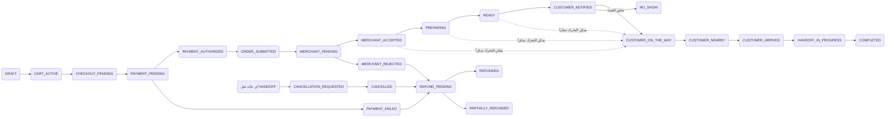

# 05 — آلة حالات الطلب (Order State Machine)

المصدر السابق: 03 · **القائمة مغلقة حرفياً — لا حالة خارجها في أي طبقة**

---

## 1. الحالات (24)

```text
DRAFT                    سلة لم تكتمل
CART_ACTIVE              سلة نشطة مسعّرة
CHECKOUT_PENDING         في شاشات الإتمام
PAYMENT_PENDING          دفع قيد التنفيذ (3DS...)
PAYMENT_AUTHORIZED       مبلغ محجوز (إن دعمت البوابة Auth/Capture)
PAYMENT_FAILED           فشل الدفع
ORDER_SUBMITTED          أُنشئ الطلب وأُرسل
MERCHANT_PENDING         بانتظار قبول الفرع (عداد)
MERCHANT_ACCEPTED        قبل الفرع (+Capture إن وجد)
MERCHANT_REJECTED        رفض الفرع → مسار الاسترجاع
PREPARING                قيد التحضير
READY                    جاهز
CUSTOMER_NOTIFIED        أُشعر العميل بالجاهزية
CUSTOMER_ON_THE_WAY      «أنا في الطريق» (Pickup Session نشطة)
CUSTOMER_NEARBY          اقتراب (ETA/Geofence)
CUSTOMER_ARRIVED         وصول مؤكد من العميل
HANDOFF_IN_PROGRESS      خرج الموظف للتسليم
COMPLETED                تم التسليم والتحقق
CANCELLATION_REQUESTED   طلب إلغاء قيد المعالجة
CANCELLED                ملغي
NO_SHOW                  لم يحضر وفق السياسة
EXPIRED                  انتهت صلاحيته (مثل مجدول لم يُدفع/مهلة)
REFUND_PENDING           استرجاع قيد التنفيذ
PARTIALLY_REFUNDED       استرجاع جزئي
REFUNDED                 استرجاع كامل
```

## 2. المخطط الرئيسي



ملاحظة: مسار الوصول (ON_THE_WAY→NEARBY→ARRIVED) يجري عبر **Pickup Session** موازية (`14-pickup-location-spec.md`)؛ يجوز أن يسبق READY — الفرع يراه بوضوح («وصل مبكراً») ولا يبدأ HANDOFF قبل READY.

## 3. جدول الانتقالات (المالك + الشرط)

| من → إلى | المالك | الشرط/الأثر |
|----------|--------|--------------|
| CART_ACTIVE → CHECKOUT_PENDING | العميل | سلة صالحة + quote خادمي ساري |
| CHECKOUT → PAYMENT_PENDING | النظام | Payment Intent + Idempotency-Key |
| PAYMENT_PENDING → AUTHORIZED/FAILED | webhook البوابة | التوقيع + مطابقة المبلغ والعملة |
| AUTHORIZED → ORDER_SUBMITTED | النظام | إنشاء الطلب في **معاملة DB واحدة** |
| SUBMITTED → MERCHANT_PENDING | النظام | إشعار الفرع + بدء عداد القبول |
| MERCHANT_PENDING → ACCEPTED | كاشير/مدير | يجوز مع تعديل وقت التجهيز؛ Capture |
| MERCHANT_PENDING → REJECTED | الفرع أو انتهاء العداد | سبب مغلق؛ تحرير/استرجاع؛ يُحتسب على الفرع |
| ACCEPTED → PREPARING | مطبخ/كاشير | مؤقت KDS |
| PREPARING → READY | مطبخ | منع «جاهز» ناقص العناصر |
| READY → CUSTOMER_NOTIFIED | النظام | إشعار + «متى تتحرك» |
| (ACCEPTED..NOTIFIED) → ON_THE_WAY | العميل | «أنا في الطريق» → Pickup Session |
| ON_THE_WAY → NEARBY | النظام | ETA/Geofence (10/5/3 د) |
| NEARBY/ON_THE_WAY → ARRIVED | **العميل حصراً** | تأكيد يدوي — لا GPS وحده |
| ARRIVED → HANDOFF_IN_PROGRESS | موظف التسليم | «خرج الموظف» + الطلب READY |
| HANDOFF → COMPLETED | تحقق | رمز/QR/زر العميل/تأكيد اللوحة (مزدوج للقيمة العالية) |
| CUSTOMER_NOTIFIED → NO_SHOW | نظام | تجاوز عتبة السياسة بعد تذكير |
| قبل HANDOFF → CANCELLATION_REQUESTED → CANCELLED | عميل/فرع/أدمن | وفق مصفوفة الإلغاء في `06` |
| REJECTED/CANCELLED/NO_SHOW/شكوى → REFUND_PENDING → REFUNDED/PARTIALLY | Finance آلي | ledger مستقل، منع التكرار |

## 4. القواعد الصلبة (من المخطط الشامل — مُلزمة)

1. لا رحلة قبل وجود طلب صالح (≥ MERCHANT_ACCEPTED... يُسمح بها من ACCEPTED فصاعداً).
2. التوجه قبل الجاهزية مسموح، والفرع يراه بوضوح.
3. **لا تتحول الحالة إلى «وصل» بإشارة GPS واحدة** — تأكيد العميل شرط.
4. لا COMPLETED دون تأكيد تسليم.
5. كل انتقال يُحفظ في `order_status_history` **غير قابل للتعديل** (من، متى، لماذا، بأي جهاز).
6. كل أمر دفع أو إنشاء طلب يستخدم Idempotency Key — تحديث الصفحة لا ينشئ طلباً ثانياً أبداً.
7. أحداث النطاق المقابلة (`12-domain-events.md`) تُبث عند كل انتقال.
8. حالات العرض للعميل (شريط الـ7) هي إسقاط مبسط من هذه القائمة — الخريطة في `07-prd.md`.
