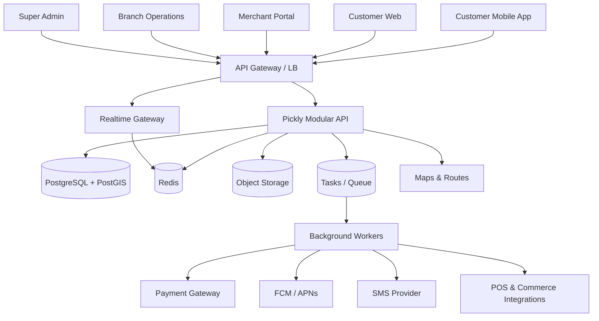

# 09 — البنية التقنية (Technical Architecture)

المصدر السابق: 00 §8، 01، 07

---

## 1. القرار المعماري

**Modular Monolith + Event-Driven Jobs** — لا Microservices كاملة. المبررات: فريق أصغر، تطوير أسرع، معاملات الطلب/الدفع أسهل، اختبارات أبسط، تشغيل أرخص، وقابلية فصل الوحدات لاحقاً.

## 2. المكدس (مقفول)

| الطبقة | الاختيار |
|--------|----------|
| تطبيق العميل | **React Native + Expo + Expo Router + TypeScript** — Development Build (لا Expo Go) للخصائص الخلفية، Secure Store، Push، Location/Task Manager، خرائط Native |
| ويب العميل / بوابة التاجر / شاشة الفرع / الأدمن / الموقع | **Next.js + TypeScript**، RTL، Responsive، React Query، Design System مشترك؛ شاشة الفرع PWA بملء الشاشة + أصوات + WebSocket (قابلة للتحول لتطبيق Android) |
| الخادم | **Node.js + TypeScript + Fastify**، REST موثق **OpenAPI**، **Zod** للتحقق، **Prisma** (منضبط: migrations ملفات، لا سحر)، WebSocket/SSE للأحداث الحية |
| البيانات | **PostgreSQL + PostGIS** · **Redis** · **BullMQ** (أو Queue سحابية) · Object Storage للصور والوثائق · محرك بحث لاحقاً عند الحاجة |
| السحابة | **Google Cloud**: Cloud Run، Cloud SQL for PostgreSQL، Memorystore، Cloud Storage، Cloud Tasks/PubSub، Secret Manager، Cloud Armor، Logging/Monitoring، Artifact Registry، Cloud Build أو GitHub Actions |
| الخرائط | Routes API لحساب المسار والمدة (لا مسافة مستقيمة) |
| الرسائل | FCM (+APNs) للدفع، SMS محلي للحالات الحرجة |

**قابلية النقل (مُلزمة):** Docker، PostgreSQL قياسي، Redis قياسي، S3-compatible abstraction، Terraform، وعدم ربط منطق المنتج بخدمة احتكارية قدر الإمكان.

## 3. الرسم المعماري



## 4. الوحدات البرمجية (38 — قائمة مغلقة)

Authentication · Customers · Vehicles · Merchants · Brands · Branches · Catalog · Menus · Availability · Discovery · Search · Carts · Pricing · Promotions · Orders · Order State Machine · Pickup Sessions · Location and ETA · Arrival Queue · Handoff · Payments · Refunds · Settlements · Subscriptions · Notifications · Reviews · Support · Risk · Integrations · Webhooks · Analytics Events · Files · CMS · RBAC · Audit Logs · Feature Flags · System Jobs · Health and Monitoring.

**بنية كل وحدة (إلزامية):** Domain · Service · Repository · API Routes · DTO/Schema (Zod) · Permissions · Events · Tests.

## 5. هيكل Monorepo

```text
pickly/
├── apps/ customer-mobile · customer-web · merchant-web · branch-ops · admin-web · api · worker
├── packages/ ui · mobile-ui · contracts · database · auth · payments · geo · notifications · observability · eslint-config · tsconfig
├── docs/            # هذه السلسلة 00–20
├── infra/ terraform · docker · monitoring
├── tests/ integration · e2e · load · security
├── .github/workflows
├── CLAUDE.md
├── docker-compose.yml
└── pnpm-workspace.yaml
```

## 6. قواعد معمارية صلبة

1. `packages/contracts` (أنواع + مخططات Zod + OpenAPI) هو العقد الوحيد بين الواجهات والخادم — لا أنواع مكررة.
2. الاتصال بين الوحدات داخل الـMonolith عبر Services وEvents فقط — لا استيراد Repository وحدة أخرى.
3. كل كتابة مالية أو انتقال حالة في **معاملة DB واحدة** + حدث Outbox.
4. Realtime قناة نشر فقط — مصدر الحقيقة هو REST/DB (إعادة الاتصال تعيد الجلب).
5. Feature Flags لكل خاصية جديدة قابلة للإيقاف دون نشر.
6. الأسرار في Secret Manager حصراً؛ لا env في المستودع.
7. Workers idempotent — كل Job قابل لإعادة التشغيل بأمان (Dead Letter بعد المحاولات).
