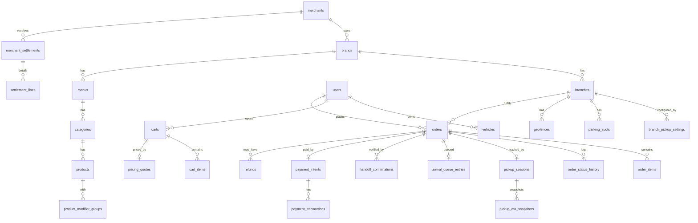

# 10 — قاعدة البيانات (Database ERD)

المصدر السابق: 05، 06، 09 · PostgreSQL + PostGIS · **قائمة الجداول مغلقة (~90 جدولاً) — جدول جديد = تعديل هذه الوثيقة أولاً**

---

## 1. المجالات والجداول

### الهوية والحسابات
`users` · `customer_profiles` · `user_sessions` · `devices` · `otp_requests` · `user_consents` · `roles` · `permissions` · `role_permissions` · `user_roles`

### السيارات
`vehicles` (اللوحة **مشفرة** + عمود مختصر للعرض) · `vehicle_photos` · `customer_default_vehicles`

### التجار
`merchants` · `merchant_legal_profiles` · `merchant_bank_accounts` · `merchant_documents` · `brands` · `branches` (location: geography Point) · `branch_hours` · `branch_closures` · `branch_contacts` · `branch_pickup_settings` (نصف قطر تنبيه + نصف قطر وصول، زمن خدمة مستهدف، إلزام موقف، مجدول وسعات) · `parking_spots` · `geofences` · `merchant_staff` · `staff_branch_assignments`

### القوائم
`menus` · `menu_schedules` · `categories` · `products` · `product_images` · `product_variants` · `modifier_groups` · `modifiers` · `product_modifier_groups` · `branch_product_availability` · `tax_rules`

### السلة والتسعير
`carts` · `cart_items` · `cart_item_modifiers` · `pricing_quotes` (التسعير خادمي — BR-6) · `fees` · `coupons` · `promotions` · `promotion_rules` · `coupon_redemptions`

### الطلبات
`orders` (order_status من قائمة الـ24 حرفياً + لقطات أسعار) · `order_items` · `order_item_modifiers` · `order_status_history` (**append-only**: من/متى/سبب/جهاز) · `order_notes` · `order_adjustments` (تعديلات BR-4 بموافقة العميل) · `scheduled_pickup_slots` · `branch_capacity_slots` · `cancellations`

### الاستلام
`pickup_sessions` · `pickup_location_events` (خام، يُحذف/يُلخص وفق الاحتفاظ) · `pickup_eta_snapshots` · `arrival_events` · `arrival_queue_entries` · `handoff_assignments` · `handoff_attempts` · `handoff_confirmations` (طريقة التحقق: code/qr/customer_button/board)

### الدفع
`payment_intents` · `payment_transactions` · `payment_webhook_events` (خام موقّع) · `refunds` · `refund_items` (منع التكرار) · `merchant_settlements` · `settlement_lines` · `merchant_payouts` · `invoices` · `invoice_lines`

### التواصل والدعم
`notifications` · `notification_deliveries` (وصل؟ فُتح؟) · `notification_templates` · `support_tickets` · `support_messages` · `support_attachments` · `dispute_cases`

### تجربة العميل
`favorites` · `reviews` (5 أبعاد + بقشيش مرجعياً) · `review_categories` · `customer_wallet_entries` (v2 — الجدول يُنشأ) · `loyalty_accounts` · `loyalty_transactions` (v2)

### النظام
`integrations` · `integration_credentials` (مشفرة) · `api_keys` · `webhook_subscriptions` · `webhook_deliveries` · `background_jobs` · `dead_letter_jobs` · `audit_logs` (قبل/بعد، لا حذف) · `feature_flags` · `system_settings` · `analytics_events`

## 2. مخطط العلاقات المحورية

## 3. قواعد العزل (مُلزمة حرفياً)

1. كل سجل تجاري يحمل `merchant_id` عند الحاجة، وكل سجل تشغيلي يحمل `branch_id`.
2. كل استعلام للتاجر يطبق **Tenant Scope** (Middleware إلزامي في طبقة Repository — لا استعلام خام يتجاوزه).
3. Super Admin وحده يتجاوز العزل، وكل تجاوز يُسجل في `audit_logs` بسبب.
4. بيانات العميل تجاه التاجر: الاسم مختصر، الجوال مقنّع، اللوحة مختصرة — الكامل أثناء الطلب النشط لموظفي الفرع المعني فقط.

## 4. قواعد بيانات صلبة

- المبالغ بالهللة int — لا floats. الأوقات timestamptz UTC.
- الحالات enums مطابقة حرفياً للوثيقتين 05 و12.
- لقطات (snapshots) للأسماء والأسعار في order_items — المنيو يتغير والطلب لا.
- `order_status_history` وaudit_logs وpayment_webhook_events append-only (بلا UPDATE/DELETE صلاحيةً).
- فهارس أساسية: orders(branch_id, order_status) · orders(user_id, created_at desc) · branches gist(location) · arrival_queue_entries(branch_id, priority) · settlement_lines(settlement_id) · analytics_events(name, created_at).
- سياسة احتفاظ: pickup_location_events خام 30 يوماً بعد الإكمال ثم حذف/تلخيص (17§4).
